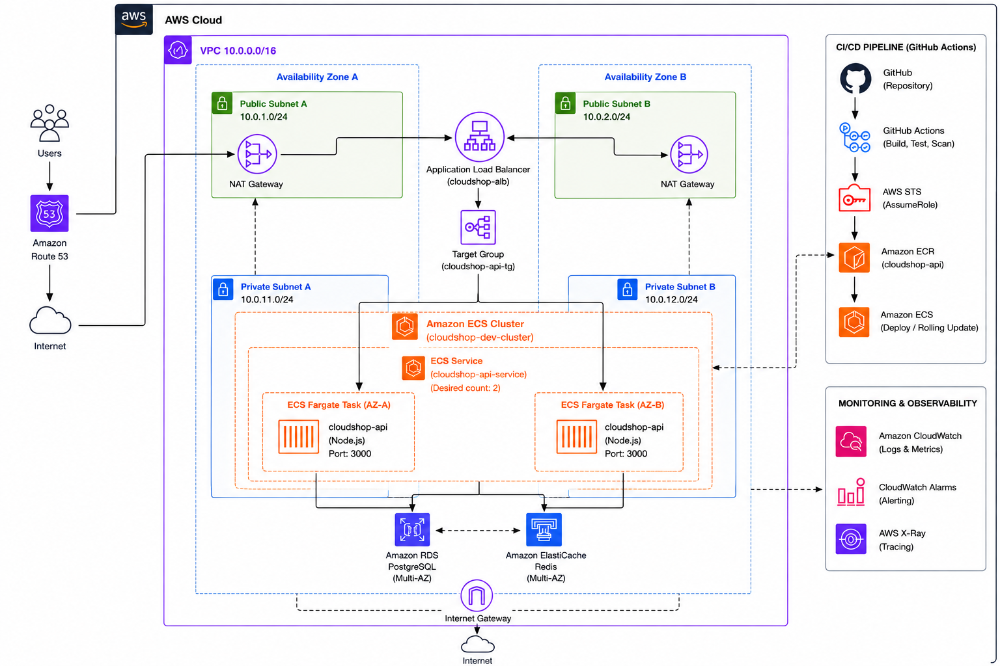

# ☁️ CloudShop — AWS DevOps E-Commerce Platform

CloudShop is a hands-on DevOps project that demonstrates how a
containerized e-commerce backend can be built, tested, and deployed
to AWS using modern DevOps practices.

The project focuses on containerization, CI/CD automation,
cloud infrastructure, security, scalability, and observability.

## 🎯 Project Goals

- Containerize the application using Docker.
- Run multiple services locally with Docker Compose.
- Use Nginx as a reverse proxy.
- Store persistent application data in PostgreSQL.
- Use Redis for caching.
- Build automated CI/CD pipelines with GitHub Actions.
- Store Docker images in Amazon ECR.
- Deploy the application using Amazon ECS Fargate.
- Design a secure AWS network architecture.
- Implement monitoring and observability.

## 🏗️ Architecture

The CloudShop infrastructure is designed around a multi-AZ AWS VPC
architecture. Public-facing components receive client traffic while
application and data services remain isolated in private subnets.

